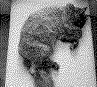
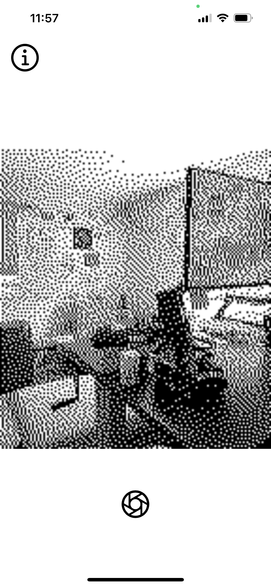

#  Pico Cam for iOS

An iOS camera app for goblins.

A re-implementation of the web version, <https://smallandnearlysilent.com/pico-cam/>

## Example output from the app

## Screenshots of the app

